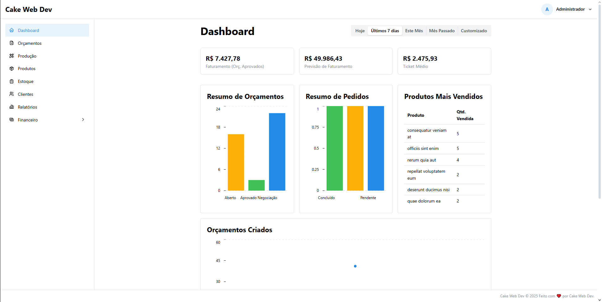
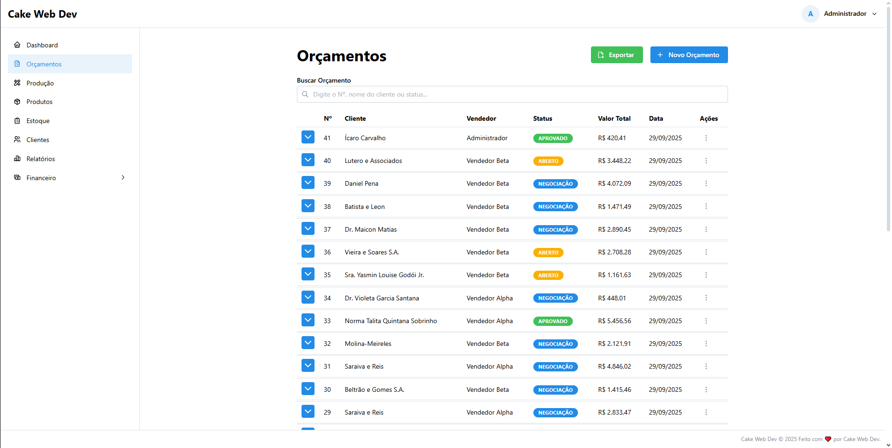
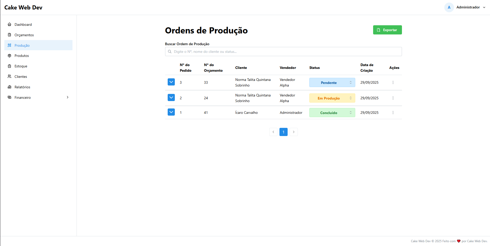
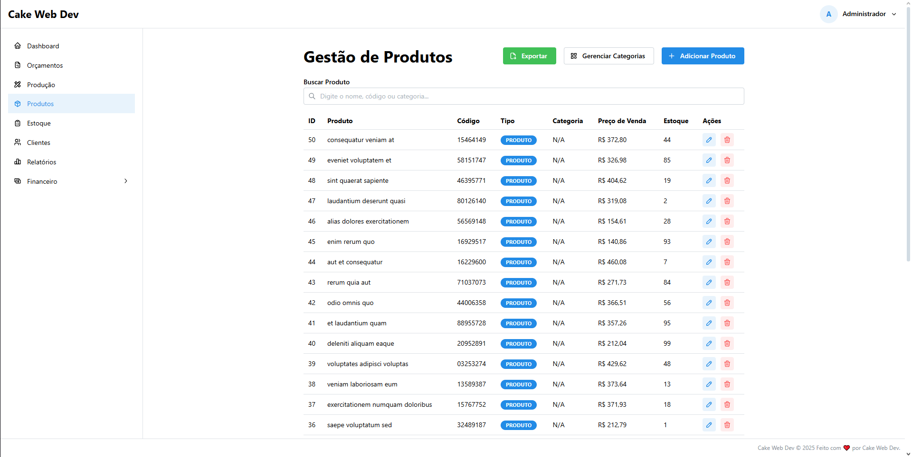
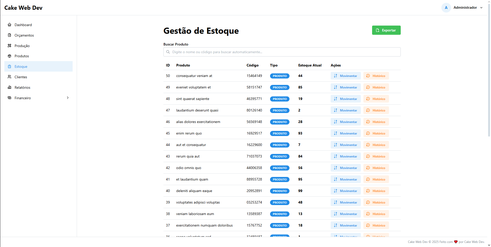
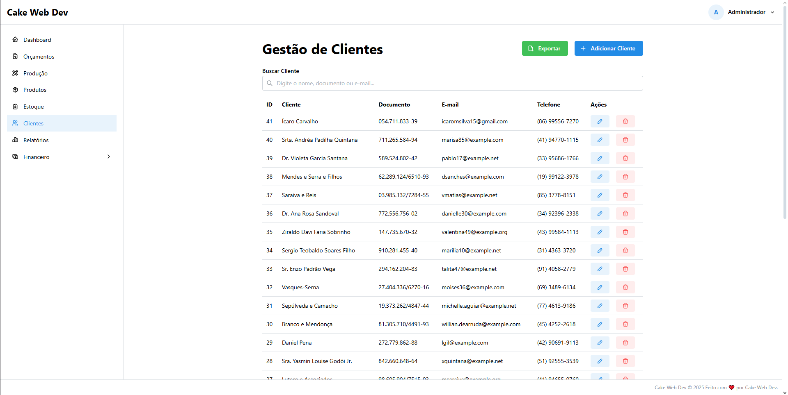
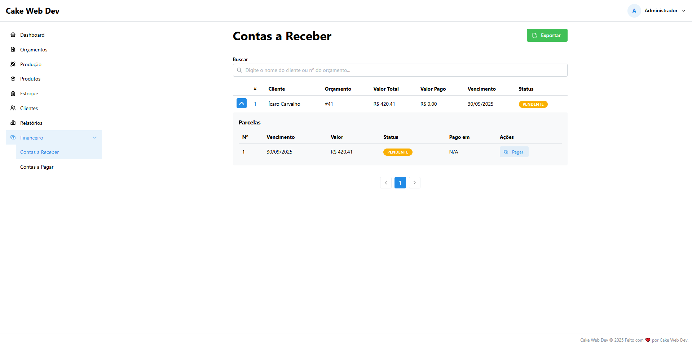
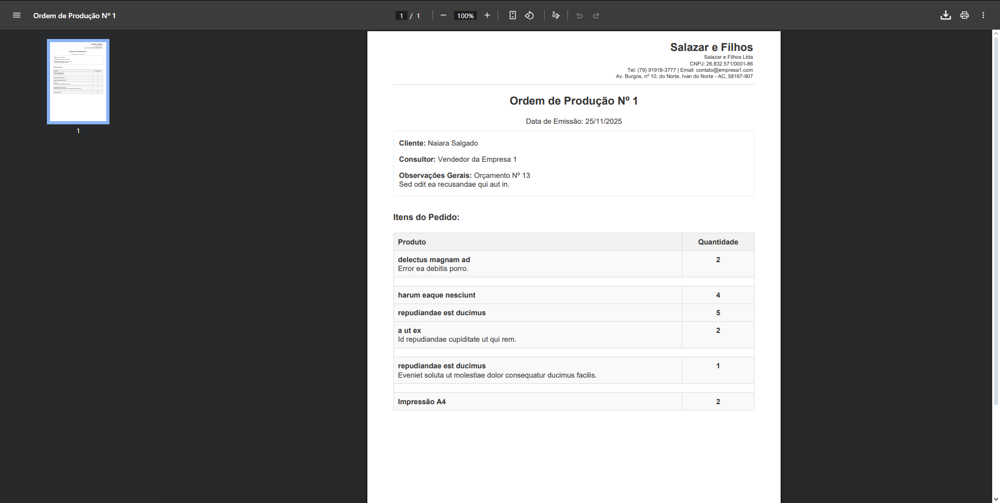
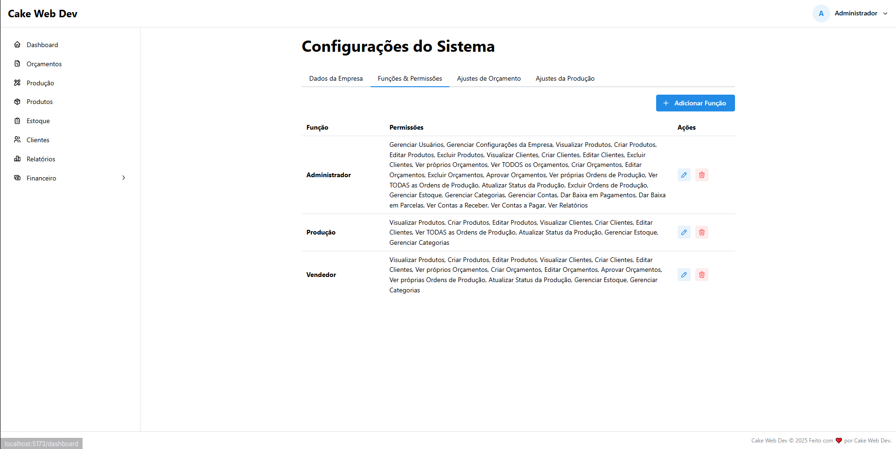
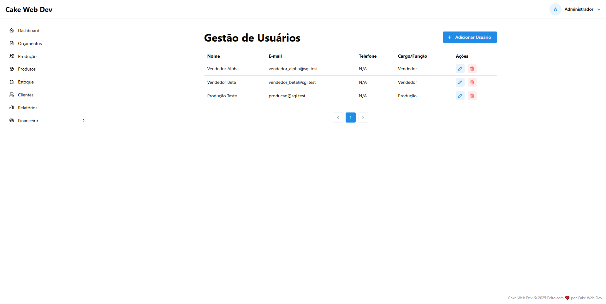

# SGI Drav Dev - Sistema de Gestão Integrado (v1.5 - SaaS Edition)

Um Sistema de Gestão Integrado (ERP/CRM) **Multi-Tenant (SaaS)** moderno, construído do zero com uma stack full-stack. Este projeto, desenvolvido como parte do portfólio da **Drav Dev**, demonstra a criação de uma plataforma de software robusta, escalável e segura, pronta para atender múltiplas empresas simultaneamente.

O sistema foi arquitetado para que **cada empresa cliente** (cada "tenant") tenha seus próprios dados 100% isolados, com configurações, numeração de documentos e fluxos de trabalho independentes.

---

## ✨ Funcionalidades Principais (v1.5)

O SGI conta com um conjunto completo de módulos integrados para gerenciar as operações de um negócio do início ao fim.

### 🏛️ **Arquitetura SaaS Multi-Tenant**
Esta é a fundação do sistema. O SGI não é um app para uma empresa, é uma plataforma para várias.

- **Isolamento Total de Dados (Tenant-aware):** Cada dado do sistema (`customers`, `products`, `quotes`, `accounts_payables`, `stock_movements`, etc.) é "carimbado" com um `tenant_id`, garantindo que uma empresa nunca possa ver os dados da outra.
- **Segurança Automática (Global Scopes):** Um "filtro mágico" de segurança é aplicado a 100% das consultas ao banco de dados, garantindo que o usuário logado só veja os dados que pertencem à sua empresa.
- **Configuração por Empresa:** Cada "tenant" (empresa cliente) gerencia suas próprias configurações:
    - Dados da Empresa (Logo, CNPJ, Endereço).
    - Status de Orçamento e Produção.
    - Métodos de Pagamento e Condições.
    - Fontes de Negociação e Métodos de Entrega.
- **Numeração Sequencial por Tenant:** Orçamentos (`quotes`) e Ordens de Produção (`production_orders`) possuem um `internal_id` único *por empresa*. A Empresa A tem o Orçamento Nº 1, e a Empresa B também tem o seu próprio Orçamento Nº 1.

### 🔑 **Autenticação & Permissões Dinâmicas**
- Sistema de login seguro e isolado por tenant (usuários da Empresa A não podem logar na Empresa B).
- **Sistema de Funções e Permissões** dinâmico (Spatie), permitindo que o `admin` de *cada* tenant crie seus próprios cargos e defina permissões granulares para sua equipe.

### 📊 **Dashboard Inteligente**
- Painel com KPIs financeiros, gráficos de performance e alertas operacionais (estoque baixo), **100% filtrado pelos dados do tenant logado**.
- Gráficos de "Resumo de Orçamentos", "Resumo de Pedidos" e "Ranking de Vendedores".

### 📦 **Módulo de Produtos & Serviços**
- CRUD completo que diferencia **produtos físicos** (com controle de estoque) e **serviços** (sem estoque), com gestão de categorias e imagens.

### 👥 **Módulo de Clientes**
- CRUD completo para clientes (Pessoa Física e Jurídica), com busca de CNPJ/CEP e **Cadastro Rápido**.

### 📝 **Módulo de Orçamentos**
- Fluxo de criação ágil com seções retráteis.
- **CPF Sob Demanda:** Exigência de CPF/CNPJ apenas no momento da **aprovação**, reduzindo o atrito no cadastro.
- Geração de PDFs profissionais (com o logo e dados do tenant) e envio por **E-mail** ou **WhatsApp**.
- **Cancelamento Seguro:** Exigência de um motivo de cancelamento para evitar erros de usuário.

### 🏭 **Módulo de Produção**
- Geração **automática** de Ordens de Produção a partir de orçamentos aprovados.
- Tela de gerenciamento de produção com **travas de segurança** (pedidos "Concluídos" ou "Cancelados" não podem ser alterados).

### 📈 **Módulo de Estoque**
- Sistema de movimentações para rastreabilidade, com baixa **automática** em vendas e atualização do preço de custo na compra.

### 💰 **Módulo Financeiro**
- **Contas a Pagar e a Receber** com CRUD completo.
- Geração **automática** de Contas a Receber a partir de pedidos concluídos.
- **Gestão de Parcelas:** O sistema lê a "Condição de Pagamento" e cria as parcelas automaticamente.
- Lógica para registro de pagamentos em parcelas individuais.

### 📈 **Módulo de Relatórios Gerenciais**
- Relatórios de **Resumo de Vendas**, **Vendas por Cliente** (sumarizado na tela, detalhado na exportação) e **Fluxo de Caixa (Previsto vs. Realizado)**.

---

## 📸 Telas do Sistema

*Uma visão geral da interface limpa e funcional do SGI.*

**Dashboard Principal**


**Página de Orçamentos**


**Página de Produção**


**Página de Produtos**


**Página de Estoque**


**Página de Clientes**


**Módulo Financeiro (Contas a Receber com Parcelas)**


**Página de Configurações**


**Página de Funções**


**Página de Gestão de Usuários**


---

## 🔮 Roadmap de Futuras Melhorias (Plataforma v2.0)

Com a fundação Multi-Tenant (v1.5) concluída, o roadmap se concentra em escalar o produto:

- **Painel do Super-Admin (O "Painel de Deus"):**
  - Construção de um painel de controle global (provavelmente com **Laravel Filament**) para a **Drav Dev** gerenciar a plataforma.
  - CRUD de `Tenants` (ativar/suspender assinaturas de clientes).
  - CRUD de `Plans` (criar e editar os planos de assinatura).

- **Testes Automatizados (A Rede de Segurança):**
  - Expandir a cobertura de testes (com Pest) para todos os módulos, garantindo a estabilidade da plataforma para todos os tenants a cada nova atualização.

- **Refinamentos de Fluxo:**
  - Implementar a funcionalidade de "Reverter Cancelamento" para Admins, com a lógica de estorno de estoque/financeiro.

- **Módulo Fiscal/Financeiro Avançado (v3.0):**
  - Integração com APIs de terceiros (ex: Asaas, PlugNotas) para emissão de **NFe/NFSe** e geração de **Boletos Registrados**.

---

## 💻 Stack Tecnológica

- **Backend (API):**
  - Laravel 11
  - PHP 8.2+
  - Laravel Sanctum (Autenticação)
  - Spatie Laravel Permission (Papéis e Permissões)
  - `barryvdh/laravel-dompdf` (Geração de PDFs)
  - MySQL

- **Frontend (Web):**
  - React 18+
  - Vite
  - TypeScript
  - Mantine UI (Biblioteca de Componentes)
  - Mantine Charts & Dates
  - Mantine Form
  - React Router
  - Axios

- **Ambiente:**
  - Laragon (para Windows)
  - Git & GitHub (Versionamento)

---

## 🚀 Como Rodar o Projeto Localmente

**Pré-requisitos:** [Laragon](https://laragon.org/download/) (ou outro ambiente com PHP 8.2+, Composer e Node.js) e Git.

1.  **Clonar o Repositório:**
    ```bash
    git clone [https://github.com/Bakaluke/sgi.git](https://github.com/Bakaluke/sgi.git)
    cd sgi
    ```

2.  **Configurar o Backend (API):**
    ```bash
    # Navegar para a pasta da API
    cd api

    # Instalar dependências
    composer install

    # Criar o arquivo de ambiente e gerar a chave
    copy .env.example .env
    php artisan key:generate

    # No arquivo .env, configure sua conexão com o banco de dados (MySQL)

    # Criar as tabelas e popular com dados de teste
    php artisan migrate:fresh --seed

    # Criar o link simbólico para os arquivos públicos
    php artisan storage:link
    
    # Iniciar o servidor da API
    php artisan serve
    ```

3.  **Configurar o Frontend (Web):**
    ```bash
    # Abrir um NOVO terminal e navegar para a pasta web
    cd web

    # Instalar dependências
    npm install

    # Criar o arquivo de ambiente
    # (Se não existir, crie um .env a partir do .env.example se houver, ou crie um .env novo)
    # Adicione a linha: VITE_API_BASE_URL=[http://127.0.0.1:8000/api](http://127.0.0.1:8000/api)
    
    # Iniciar o servidor de desenvolvimento
    npm run dev
    ```

4.  **Acessar e Testar:**
    * O frontend estará disponível em `http://localhost:5173` (ou outra porta).
    * Use os usuários de teste (ex: `admin@sgi.test`) com a senha `password`.

---

## 🍰 Sobre a Drav Dev

Este projeto foi desenvolvido com dedicação pela **Drav Dev** como parte do nosso portfólio de soluções de software customizadas. Ele demonstra nossa capacidade de construir aplicações full-stack complexas, seguras e com foco na experiência do usuário.
