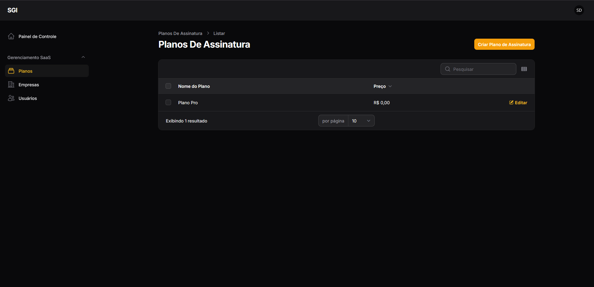

# SGI Drav Dev - Plataforma SaaS Multi-Tenant (v1.5)

**Um ERP/CRM de Manufatura e Serviços projetado para escalar.**

Desenvolvido pela **Drav Dev**, este sistema não é apenas um gerenciador de empresas; é uma plataforma **SaaS (Software as a Service) Multi-Tenant** completa. Ele permite que múltiplas empresas (tenants) operem dentro da mesma infraestrutura com isolamento total de dados, segurança robusta e fluxos de trabalho personalizados para o setor gráfico e de manufatura sob encomenda.

---

## 🚀 Destaques da Arquitetura (O "Motor" do SaaS)

O diferencial deste projeto reside nas soluções de arquitetura de software implementadas para garantir escalabilidade e isolamento:

### 1. 🏛️ Arquitetura Multi-Tenant "Shared Database"
- **Isolamento Lógico (The Wall):** Implementação de `Global Scopes` automáticos em todos os Models. O sistema aplica filtros de segurança (`WHERE tenant_id = X`) em 100% das consultas, garantindo que os dados de uma empresa sejam invisíveis para outras.
- **Segurança de Fábrica:** Policies e Gates garantem que usuários só acessem recursos do seu próprio tenant.

### 2. 🔢 IDs Sequenciais por Tenant
- Diferente de sistemas tradicionais que expõem IDs globais do banco de dados (ex: Orçamento #4592), o SGI implementa uma lógica de **numeração sequencial isolada**.
- A Empresa A tem o **"Orçamento Nº 1"**. A Empresa B também tem o seu **"Orçamento Nº 1"**.
- Aplicado em: Clientes, Produtos, Orçamentos, Ordens de Produção e Contas a Pagar.

### 3. 🧪 Engenharia de Produto (Bill of Materials)
- Suporte para produtos do tipo **"Serviço"** com **Composição (Receita)**.
- O sistema permite definir que 1 unidade do serviço "Impressão A3" consome X unidades da matéria-prima "Papel A3" e Y unidades de "Tinta".

### 4. 🤖 Automação de Estoque Inteligente
- Baixa de estoque automatizada baseada em eventos (`ProductionStarted`).
- Quando a Produção altera o status de um pedido para **"Em Produção"**, o sistema calcula a receita e deduz automaticamente as matérias-primas do estoque.

### 5. 👁️ O "Painel de Deus" (Super Admin)
- Painel administrativo exclusivo (construído com **Laravel Filament**) para a Drav Dev.
- Gerenciamento centralizado de **Empresas (Tenants)**, **Planos de Assinatura** e **Usuários Globais**.
- Dashboard com KPIs de saúde da plataforma (Total de Clientes, MRR, etc.) e preenchimento automático de dados via CNPJ.

---

## ✨ Funcionalidades do SGI (O Produto)

### 📊 Dashboard & Analytics
- Interface moderna com **Modo Escuro (Dark Mode)** automático.
- Gráficos de funil de vendas, status de produção e faturamento.
- Alertas inteligentes de **Estoque Baixo** e **Orçamentos Parados**.

### 📝 Orçamentos (CRM) & Kanban
- **Gestão Visual (Kanban):** Quadro interativo com *Drag & Drop* para mover orçamentos entre status (Aberto -> Negociação -> Aprovado) com validação automática de regras de negócio.
- Criação rápida com cálculo automático de lucro e descontos.
- Geração de **PDFs Profissionais** instantâneos com a marca da empresa cliente.
- Envio direto para WhatsApp e E-mail.

### 🏭 Produção & Chão de Fábrica
- Transformação automática de Orçamentos aprovados em **Ordens de Produção**.
- Controle de status (Pendente -> Em Produção -> Concluído).
- Geração de **Ordem de Serviço** (interna) e **Protocolo de Entrega** (cliente) em PDF.
- Visualização clara da "Receita" (materiais necessários) para cada item.

### 💰 Financeiro
- **Contas a Receber:** Geração automática baseada nas condições de pagamento do orçamento.
- **Contas a Pagar:** Controle de despesas operacionais.
- Relatórios de Fluxo de Caixa (Previsto vs. Realizado).

---

## 📸 Galeria do Sistema

*Uma visão geral da interface limpa e funcional do SGI.*

### O "Painel de Deus" (Filament Super Admin)
*Gerenciamento global da plataforma pela Drav Dev.*



### Dashboard Operacional (Modo Escuro)
*Visão geral para o cliente final.*


### Módulo de Orçamentos
*Criação e edição com IDs sequenciais.*


### Kanban de Orçamentos
*Visualização dos orçamentos usando a metodologia japonesa.*


### Engenharia de Produto
*Definição da composição (receita) de um serviço.*


### Gerenciamento de Estoque
*Controle de entrada e saída de produtos do estoque.*


### Produção e PDFs
*Controle de produção e documentos gerados.*


### Relatórios Financeiros


---

## 🔮 Roadmap de Futuras Melhorias (Plataforma v2.0)

Com a fundação Multi-Tenant (v1.5) concluída, o roadmap se concentra em escalar o produto:

- **Testes Automatizados (A Rede de Segurança):**
  - Expandir a cobertura de testes (com Pest) para todos os módulos, garantindo a estabilidade da plataforma para todos os tenants a cada nova atualização.

- **Refinamentos de Fluxo:**
  - Implementar a funcionalidade de "Reverter Cancelamento" para Admins, com a lógica de estorno de estoque/financeiro.

- **Módulo Fiscal/Financeiro Avançado (v3.0):**
  - Integração com APIs de terceiros (ex: Asaas, PlugNotas) para emissão de **NFe/NFSe** e geração de **Boletos Registrados**.

---

## 💻 Stack Tecnológica

O projeto utiliza uma stack moderna e robusta, focada em performance e manutenibilidade.

**Backend (API RESTful)**
- **Framework:** Laravel 11 (PHP 8.3)
- **Admin Panel:** Filament 3 (para o Super Admin)
- **Auth:** Laravel Sanctum (Tokens seguros)
- **PDFs:** `barryvdh/laravel-dompdf`
- **Banco de Dados:** MySQL 8

**Frontend (SPA)**
- **Framework:** React 18 (Vite)
- **Linguagem:** TypeScript
- **UI Kit:** Mantine UI v7 (Componentes, Hooks, Notifications)
- **Charts:** Recharts / Mantine Charts
- **State Management:** React Context API + Hooks Customizados
- **HTTP Client:** Axios

- **Ambiente:**
  - Laragon (para Windows)
  - Git & GitHub (Versionamento)

---

## 🚀 Como Rodar o Projeto Localmente

### Pré-requisitos
- PHP 8.3+
- Composer
- Node.js & NPM
- MySQL

1.  **Clonar o Repositório:**
    ```bash
    git clone [https://github.com/Bakaluke/sgi.git](https://github.com/Bakaluke/sgi.git)
    cd sgi
    ```

2.  **Configurar o Backend (API):**
    ```bash
    cd api
    composer install
    cp .env.example .env
    php artisan key:generate

    # Configure seu banco de dados no .env e então:
    php artisan migrate:fresh --seed
    php artisan storage:link
    php artisan serve
    ```

3.  **Configurar o Frontend (Web):**
    ```bash
    cd web
    npm install
    # Crie o arquivo .env com: VITE_API_BASE_URL=http://localhost:8000/api
    npm run dev
    ```

4.  **Acessar e Testar:**
    * Painel Super Admin: `http://localhost:8000/admin` (Login: `admin@dravdev.com`)
    * O frontend estará disponível em `http://localhost:5173` (ou outra porta).
    * Use os usuários de teste (ex: `admin@empresa1.com`, `admin@empresa2.com`) com a senha `password`.

---

## 🍰 Sobre a Drav Dev

Este projeto foi desenvolvido com dedicação pela **Drav Dev** como parte do nosso portfólio de soluções de software customizadas. Ele demonstra nossa capacidade de construir aplicações full-stack complexas, seguras e com foco na experiência do usuário.

*v1.5 - Release "Multi-Tenant & Automation"*